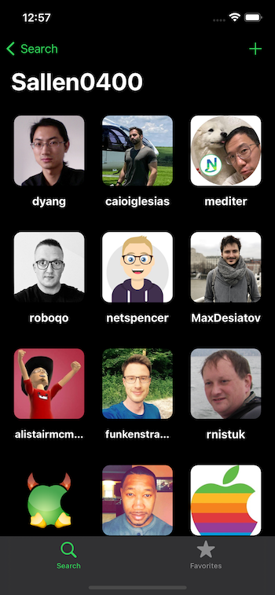
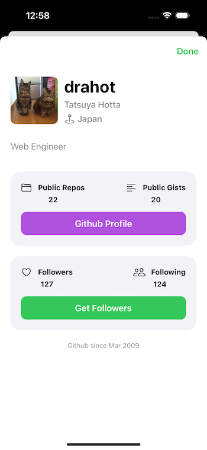
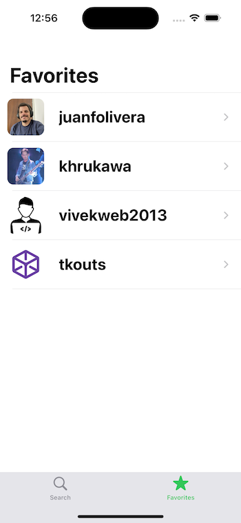
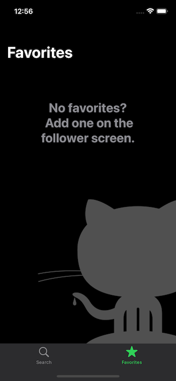

# GHFollowers
### An app where user can search a GitHub profile via Username for their followers and can also add favorites. This is a tutorial course by Sean Allen (take home project), which has been developed by programmatic UI (no storyboards).

- [x] 100% ProgrammaticUI
- [x] CollectionViews with the new DiffableDataSource
- [x] Search Controllers
- [x] Making custom UICollectionViewFlowLayout
- [x] Network Calls
- [x] Parsing JSON with Codable
- [x] Pagination of Network calls
- [x] Memory Management - Capture Lists [weak self]
- [x] Image Caching
- [x] No 3rd party libraries
- [x] Dark Mode
- [x] Custom Alerts
- [x] Project organization
- [x] Child View Controllers
- [x] UITableView
- [x] Delegation
- [x] Persistence
- [x] Proper Error Handling
- [x] Empty States
- [x] SafariViewController
- [x] SFSymbols
- [x] StackViews
- [x] Date Formatters
- [x] Activity Indicators
- [x] Reusable Components
- [x] Passing Data between views

#### The Landing Screen:

---

#### The Followers Screen:

---

#### The User Info Screen:

---

#### The Favorites Screen:

---
## Credits
This app is built as part of the take-home project for the iOS Dev Job course by Sean Allen. The app uses the GitHub API to fetch the follower's details.
